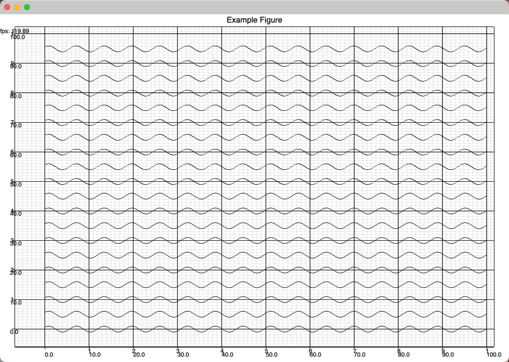

# gpui-plot

Native plotting in Rust using the `gpui` library.

**Pull Requests Welcomed**


Can also make use of `plotters` for some of the figures.
Zooming and panning is implemented

Note: the version on crates.io is only a placeholder, as gpui is not published on crates.io yet. Please use the git
version.

https://github.com/JakkuSakura/gpui-plot

## Usage

```toml
[dependencies]
gpui = { git = "https://github.com/zed-industries/zed" }
gpui-plot = { git = "https://github.com/JakkuSakura/gpui-plot" }
```

## Example

This is an example of 2 animated plots on same canvas. one is native and the other is using plotters.
You can see the FPS is 120 on my Macbook Pro.


```rust
use gpui::{div, prelude::*, App, AppContext, View, ViewContext, WindowContext, WindowOptions};
use gpui_plot::figure::axes::{AxesContext, AxesModel};
use gpui_plot::figure::figure::{FigureModel, FigureViewer};
use gpui_plot::geometry::{point2, size2, AxesBounds, AxisRange, GeometryAxes, Line};
use parking_lot::RwLock;
use plotters::prelude::*;
use std::sync::Arc;

#[allow(unused)]
struct MainViewer {
    model: Arc<RwLock<FigureModel>>,
    // animation: Animation,
    figure: View<FigureViewer>,
}

impl MainViewer {
    fn new(
        model: Arc<RwLock<FigureModel>>,
        mut animation: Animation,
        cx: &mut WindowContext,
    ) -> Self {
        let axes_bounds = AxesBounds::new(AxisRange::new(0.0, 100.0), AxisRange::new(0.0, 100.0));
        let size = size2(10.0, 10.0);
        let axes_model = Arc::new(RwLock::new(AxesModel::new(axes_bounds, size)));
        {
            let mut model = model.write();
            let mut plot = model.add_plot().write();
            plot.add_axes(axes_model.clone())
                .write()
                .plot(animation.clone());
            plot.add_axes_plotters(axes_model.clone(), move |area, cx| {
                let mut chart = ChartBuilder::on(&area)
                    .x_label_area_size(30)
                    .y_label_area_size(30)
                    .build_cartesian_2d(cx.axes_bounds.x.to_range(), cx.axes_bounds.y.to_range())
                    .unwrap();

                chart.configure_mesh().draw().unwrap();
                for shift in 10..20 {
                    let line = animation.next_line((shift * 5) as f64);

                    chart
                        .draw_series(LineSeries::new(
                            line.points.iter().map(|p| (p.x, p.y)),
                            &BLACK,
                        ))
                        .unwrap();
                }
            })
        }
        Self {
            figure: cx.new_view(|_| FigureViewer::new(model.clone())),
            model,
            // animation,
        }
    }
}

impl Render for MainViewer {
    fn render(&mut self, cx: &mut ViewContext<Self>) -> impl IntoElement {
        cx.defer(move |_this, cx| {
            cx.notify();
        });

        div()
            .size_full()
            .flex_col()
            .bg(gpui::white())
            .text_color(gpui::black())
            .child(self.figure.clone())
    }
}
#[derive(Clone)]
struct Animation {
    start: f64,
    end: f64,
    step: f64,
    time_start: std::time::Instant,
}
impl Animation {
    fn new(start: f64, end: f64, step: f64) -> Self {
        Self {
            start,
            end,
            step,
            time_start: std::time::Instant::now(),
        }
    }
    fn next_line(&mut self, shift: f64) -> Line<f64, f64> {
        let mut line = Line::new();
        let t = self.time_start.elapsed().as_secs_f64() * 10.0;
        let mut x = self.start;
        while x <= self.end {
            let y = (x + t).sin();
            line.add_point(point2(x, y + shift));
            x += self.step;
        }
        line
    }
}
impl GeometryAxes for Animation {
    type X = f64;
    type Y = f64;

    fn render_axes(&mut self, cx: &mut AxesContext<Self::X, Self::Y>) {
        for shift in 0..10 {
            let mut line = self.next_line((shift * 5) as f64);
            line.render_axes(cx);
        }
    }
}
fn main_viewer(cx: &mut WindowContext) -> MainViewer {
    let figure = FigureModel::new("Example Figure".to_string());
    let animation = Animation::new(0.0, 100.0, 0.1);
    let main_viewer = MainViewer::new(Arc::new(RwLock::new(figure)), animation, cx);

    main_viewer
}

fn main() {
    App::new().run(move |cx: &mut AppContext| {
        cx.open_window(
            WindowOptions {
                focus: true,
                ..Default::default()
            },
            move |cx| {
                let view = main_viewer(cx);
                cx.new_view(move |_| view)
            },
        )
            .unwrap();
        cx.activate(true);
    });
}
```
